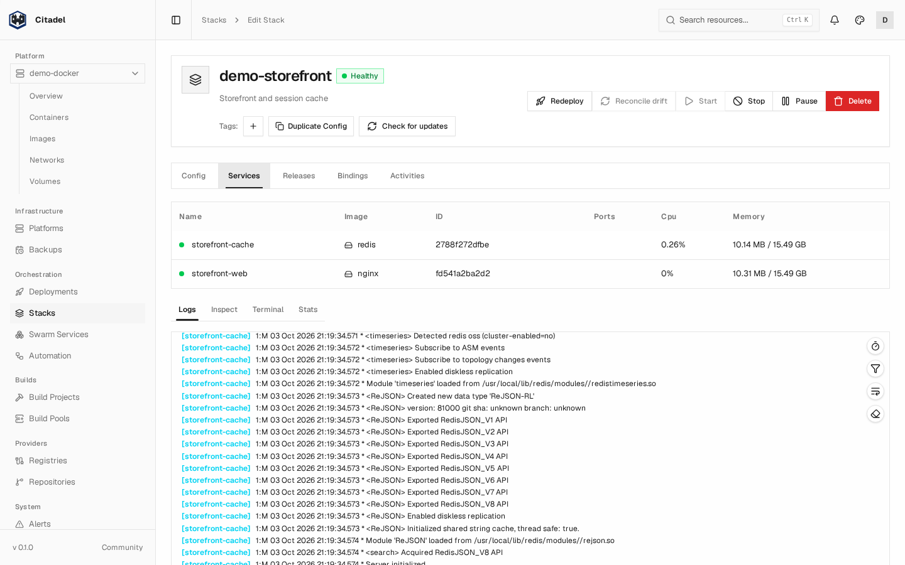
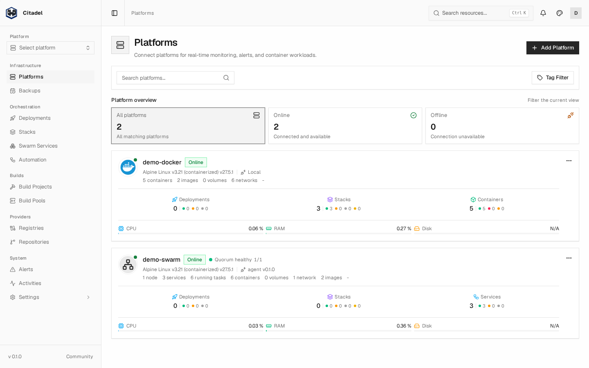
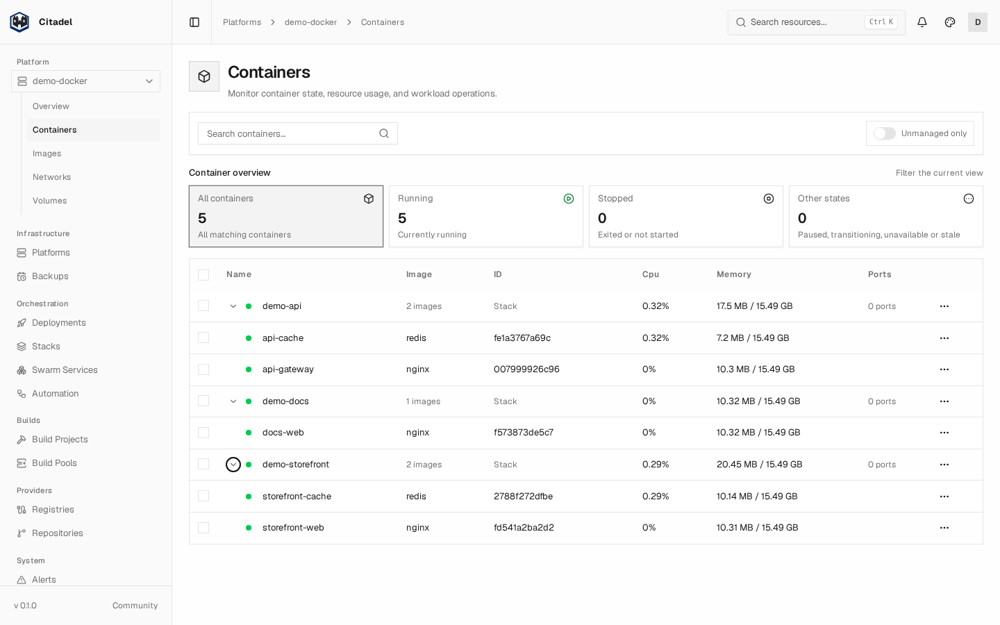
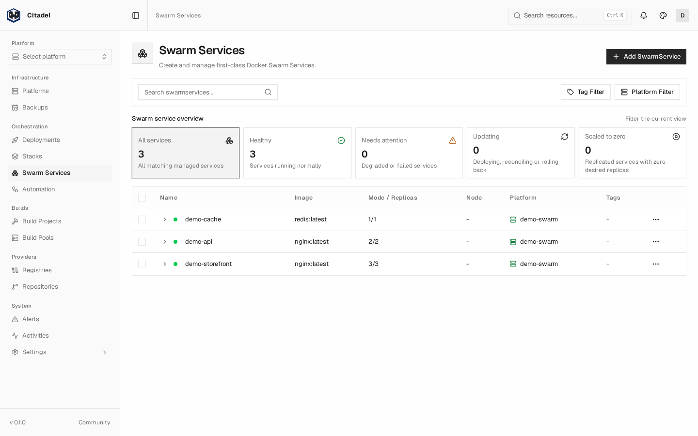
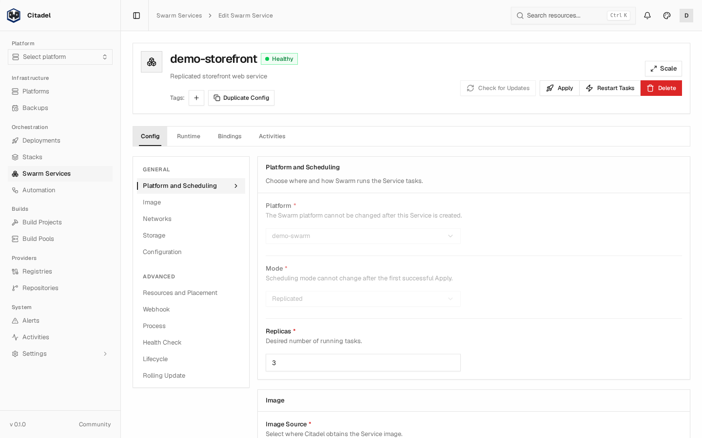
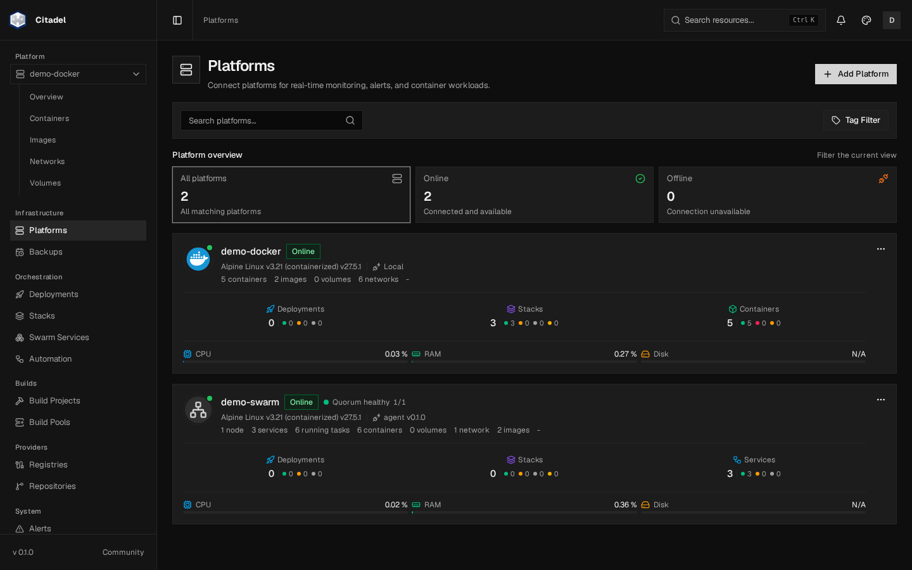

<p align="center">
  
</p>

<h1 align="center">Citadel</h1>

<p align="center">
  <strong>A self-hosted management platform for Docker and Swarm.</strong>
</p>

Citadel is a self-hosted Docker management platform for developers and teams. Build images from Git, deploy containers and Compose stacks, and manage Docker Standalone and Swarm across multiple hosts through one web interface.

[Documentation](https://docs.citadelplane.com/) · [Live demo](https://demo.citadelplane.com/) · [Development preview](https://preview.citadelplane.com/) · [API reference](https://docs.citadelplane.com/docs/reference/api/) · [Report an issue](https://github.com/Citadel-P/Citadel/issues)

## Try Citadel

| Site | Purpose |
| --- | --- |
| [Demo](https://demo.citadelplane.com/) | Explore the stable release |
| [Preview](https://preview.citadelplane.com/) | Explore development releases and upcoming changes |
| [Documentation](https://docs.citadelplane.com/) | Installation, resources, guides, and API reference |

**Demo sign-in:** username `demo` · password `demodemo`.

## Screenshots



<details>
<summary>Platforms, containers, and monitoring</summary>





</details>

<details>
<summary>Swarm services and replica configuration</summary>





</details>

<details>
<summary>Dark mode</summary>



</details>

## What you can do

- **Deploy applications** — manage containers and Compose stacks, deploy from Git, roll back releases, and check configuration drift.
- **Connect your hosts** — manage local Docker, remote Agents, and outbound Edge Agents; inspect resources, logs, and terminals.
- **Operate Swarm** — manage nodes, services, tasks, configs, and secrets.
- **Build and automate** — build images from Git, publish to registries, and run TypeScript actions and webhooks.
- **Monitor and recover** — track resource usage, receive alerts, and back up and restore the control plane and Docker volumes.
- **Control access** — manage users, teams, roles, and resource permissions, with MFA, OIDC sign-in, and activity history.

## Install Citadel

Run Citadel and PostgreSQL with Docker Compose using the published images. No source checkout or build is required.

On a Linux Docker host with Docker Compose **2.30 or newer**, curl, and OpenSSL, download the installation files:

```bash
mkdir -p citadel
cd citadel
curl -fSL https://raw.githubusercontent.com/Citadel-P/Citadel/main/deploy/install/docker-compose.yml -o docker-compose.yml
curl -fSL https://raw.githubusercontent.com/Citadel-P/Citadel/main/deploy/install/.env.example -o .env
chmod 600 .env
```

Generate a database password:

```bash
openssl rand -hex 32
```

Open `.env` and paste the generated value after `PG_PASSWORD=`. This password is for PostgreSQL; you create your Citadel sign-in separately during setup.

Leave `CITADEL_IMAGE` blank to use the latest stable release. To use the development channel, set `CITADEL_IMAGE=ghcr.io/citadel-p/citadel:dev`. You can also pin an exact version from the [releases](https://github.com/Citadel-P/Citadel/releases).

Start the services:

```bash
docker compose pull
docker compose up -d
docker compose ps
```

Once both services are healthy, open [http://localhost:18000](http://localhost:18000) on the Docker host, create your administrator account, and add a **Local** platform to manage that host.

The default setup binds to localhost. For a remote server or shared access, configure HTTPS using the [installation guide](https://docs.citadelplane.com/docs/getting-started/install/) and [TLS guide](https://docs.citadelplane.com/docs/operations/tls-and-secure-agent-transport/).

Citadel has administrative access to the connected Docker host. Preserve `.env` and the `citadel_data` and `postgres_data` volumes when upgrading; they contain your configuration, application keys, and database.

## Documentation and API

Start with the [quick start](https://docs.citadelplane.com/docs/getting-started/quick-start/), browse [resources](https://docs.citadelplane.com/docs/resources/) and [guides](https://docs.citadelplane.com/docs/guides/), or read the [architecture overview](https://docs.citadelplane.com/docs/overview/architecture/).

The documentation follows the newest published version across stable and development releases, so it may describe features not yet available in the stable demo.

The [API reference](https://docs.citadelplane.com/docs/reference/api/) includes an embedded ReDoc explorer for the public OpenAPI contract. Browse endpoints and schemas directly in the documentation without enabling Swagger on your installation.

For integrations, use the [public OpenAPI schema](schema/public-v1.json) from the tag matching your installed version. The public API is currently labeled **API Preview**; the full schema used by the web UI is internal.

## Editions and support

Community runs without an installed product license. See the [edition comparison](https://docs.citadelplane.com/docs/overview/licensing/) for included and paid capabilities.

For source development, see the [development guide](docs/DEVELOPMENT.md). Report bugs and request features through [GitHub Issues](https://github.com/Citadel-P/Citadel/issues).
